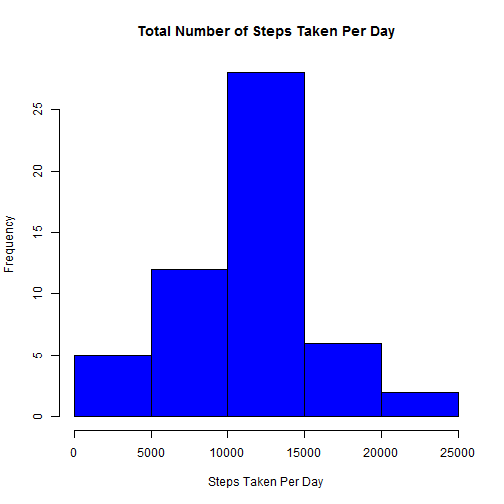
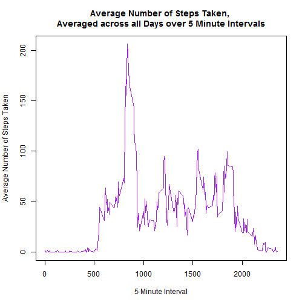
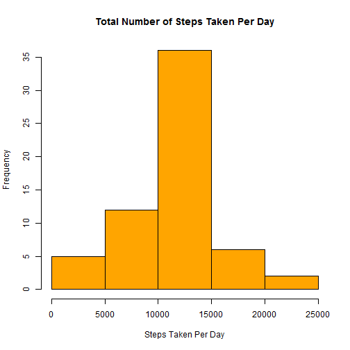
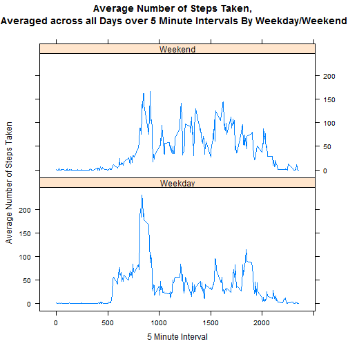

# Reproducible Research: Peer Assessment 1

13/06/2014


## Loading and preprocessing the data

- Load the data

  Reads the 'activity.csv' file from the working directory. 
  Note: This step assumes that the file has been unzipped in the current working directory.


```r
  allData <- read.csv("activity.csv", colClasses = c("numeric", "Date", "numeric"))
```

- Process and transform the data into a suitable format

  The processed data removes the dates that have 'NA' values as defined by the assignment brief. E.g. '2012-10-01' contained all NA step values and has been removed.


```r
  data <- na.omit(allData)
```

&nbsp;&nbsp;&nbsp;&nbsp;&nbsp;&nbsp;&nbsp;&nbsp;&nbsp;&nbsp;&nbsp;&nbsp;&nbsp;Creates data frames that stores the total number of steps grouped by date and the average number of steps taken per interval. These data frames will be used to answer the following questions.    


```r
  dataSteps <- aggregate(data$steps, by=list(data$date), sum, na.rm=TRUE)
  names(dataSteps)[1] <- 'date'
  names(dataSteps)[2] <- 'steps'

  dataAverage  <- aggregate(data$steps, by=list(data$interval), mean, na.rm=TRUE)
  names(dataAverage)[1] <- 'interval'
  names(dataAverage)[2] <- 'steps'
```

## What is mean total number of steps taken per day?

- Make a histogram of the total number of steps taken each day

```r
  hist(dataSteps$steps, col="blue", main="Total Number of Steps Taken Per Day", xlab="Steps Taken Per Day")
```

 

- Calculate and report the mean and median total number of steps taken per day

```r
  mean <- mean(dataSteps$steps, na.rm=TRUE)
  median <- median(dataSteps$steps, na.rm=TRUE)
```

&nbsp;&nbsp;&nbsp;&nbsp;&nbsp;&nbsp;&nbsp;&nbsp;&nbsp;&nbsp;&nbsp;&nbsp;&nbsp;The mean number of steps taken per day is **10766.19**. The median number of steps taken per day is **10765**.

## What is the average daily activity pattern?

- Time series plot of the 5-minute interval and the average number of steps taken, averaged across all days 

```r
  plot(dataAverage$interval, dataAverage$steps, type="l", col="purple",
    main="Average Number of Steps Taken, \nAveraged across all Days over 5 Minute Intervals",
    xlab = "5 Minute Interval", ylab = "Average Number of Steps Taken")  
```

 

- Which 5-minute interval, on average across all the days in the dataset, contains the maximum number of steps?

```r
  maxStepInterval <- dataAverage[head(order(-dataAverage$steps), 1), ]$interval
```
&nbsp;&nbsp;&nbsp;&nbsp;&nbsp;&nbsp;&nbsp;&nbsp;&nbsp;&nbsp;&nbsp;&nbsp;&nbsp;The 5-minute interval, that on average across all days has the maximum number of steps is **835**.

## Imputing missing values

- Calculate and report the total number of missing values in the dataset (i.e. the total number of rows with NAs)

```r
  missing <- nrow(allData[allData$steps=="NA", ])
```

&nbsp;&nbsp;&nbsp;&nbsp;&nbsp;&nbsp;&nbsp;&nbsp;&nbsp;&nbsp;&nbsp;&nbsp;&nbsp;The number of missing values in the dataset is **2304**.

- Replace the missing step values in the dataset with the mean steps per interval over every day.

```r
  imputedData <- allData
  for(n in 1 : nrow(imputedData)) 
  {
    t <- imputedData[n, ]
  	if (is.na(t$steps)) 
    {
    	imputedData[n, 1] <- subset(dataAverage,interval==t$interval)$steps
  	} 
  }

  imputedDataSteps <- aggregate(imputedData$steps, by=list(imputedData$date), sum, na.rm=TRUE)
  names(imputedDataSteps)[1] <- 'date'
  names(imputedDataSteps)[2] <- 'steps'
```

- Make a histogram of the total number of steps taken each day

```r
  hist(imputedDataSteps$steps, col="orange", main="Total Number of Steps Taken Per Day", xlab="Steps Taken Per Day")
```

 

- Calculate and report the mean and median total number of steps taken per day

```r
  imputedMean <- mean(imputedDataSteps$steps, na.rm=TRUE)
  imputedMedian <- median(imputedDataSteps$steps, na.rm=TRUE)
```

&nbsp;&nbsp;&nbsp;&nbsp;&nbsp;&nbsp;&nbsp;&nbsp;&nbsp;&nbsp;&nbsp;&nbsp;&nbsp;The mean number of steps taken per day is **10766.19**. The median number of steps taken per day is **10766.19**.


## Are there differences in activity patterns between weekdays and weekends?

- Create a new factor variable in the dataset with two levels - "weekday" and "weekend" indicating whether a given date is a weekday or weekend day.

  The new factor created is called dayOfWeek.
  

```r
  imputedData$dayOfWeek <- ""

  for(n in 1 : nrow(imputedData))
  {
    if(weekdays(imputedData[n, 2]) == "Saturday" || weekdays(imputedData[n, 2]) == "Sunday")
    {
      imputedData[n, 4]  <-  "Weekend"
    } else {
      imputedData[n, 4]  <-  "Weekday"
    }
  }
```

- Make a panel plot containing a time series plot (i.e. type = "l") of the 5-minute interval (x-axis) and the average number of steps taken, averaged across all weekday days or weekend days (y-axis). 


```r
  imputedDataAverage <- aggregate(imputedData$steps, by=list(imputedData$interval, imputedData$dayOfWeek), mean, na.rm=TRUE)
  names(imputedDataAverage)[1] <- 'interval'
  names(imputedDataAverage)[2] <- 'dayOfWeek'
  names(imputedDataAverage)[3] <- 'steps'

  xyplot(steps~interval | dayOfWeek, imputedDataAverage, type="l",
       layout=c(1,2), xlab="5 Minute Interval", ylab = "Average Number of Steps Taken")
```

 

